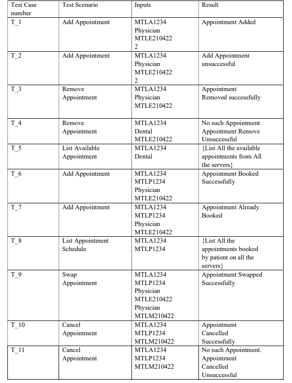

# DAMS
 WebServices

Distributed Appointment Management System (DAMS) is a designed application used by patients to 
book appointments in Montreal, Quebec and Sherbrooke Hospitals. Another user, admin is the 
administrator who manages all the appointment of the patients. All three cities are the three servers, 
Montreal, Quebec and Sherbrooke. We have already implemented the DAMS system using RMI, 
CORBA and Web-Services Distributed System Implementation Techniques. As we have all 
distributed implementation technique of DAMS we now focus to characterize our DAMS system 
using very important Distributed System Characteristic known as Failure Tolerance. 

Failure Tolerance is the ability of the distributed system to produce correct results even if certain 
number of components fail. Why do we need Failure Tolerance in Distributed System? Distributed 
System must maintain 100% (most of the time 99.99% practically) availability even if any hardware, 
software or network fails. Which means if one component fails there must be another component to 
provide the backup for the failed component and process the request successfully this is achieved by 
Replication. Replication is one of the important features of the Distributed Systems and is 
implemented by creating multiple replications of the servers known as replicas performing the same 
functionality as requested by client individually. 

In this project, we are designing our DAMS application as Software Failure Tolerance using Active 
Total Order Replication with Reliable Multicast using Kaashoek’s Protocol. 

# Test- Cases

# Install and Configure DAMS-WebServices(Distributed Appointment Management System) to Handle Software Failure Tolerance

1. Configure the src folder on 3 different systems (as the project works on LAN)
2. Setup each Replica Manager (RM) on each system (ReplicaManager1 on one system and rest on another).
3. Start each server (MTLServer,QUEServer, SHEServer)
4. Start FrontEnd (FrontEnd)
5. Run the ReplicaManagers on each system to see the reply-response for each RM on the servers as requested.